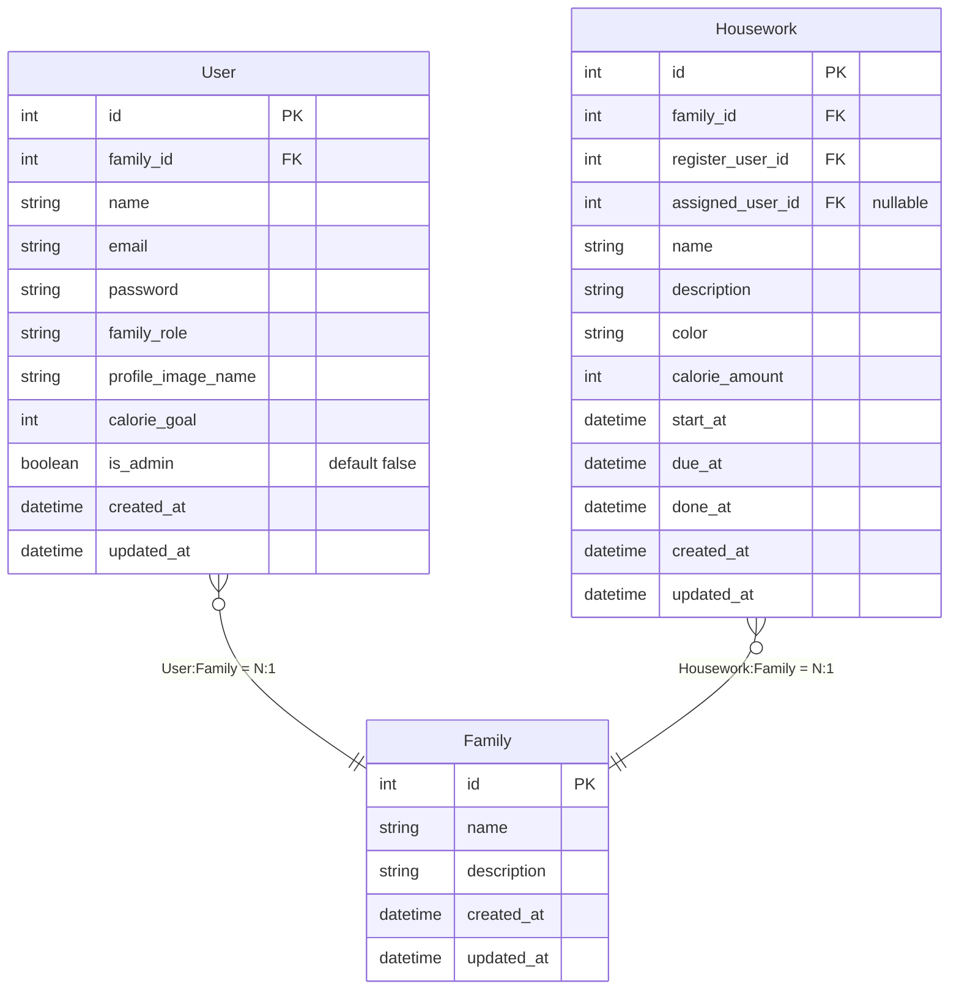

# Team D

| 이름      | 담당           |
|---------|--------------|
| 민인애(팀장) | Figma, 프론트엔드 |
| 배장한     | ERD, 백엔드     |

### 링크 모음

- [Notion](https://www.notion.so/Health-Kitchen-129e59326f7a806cbffaf2890f07a801)  
- [Figma](https://www.figma.com/design/hKIkH0IpojhDqeF1Qw2K5j/final_pjt?node-id=0-1&t=tKCWinNCdaXFLUjm-1)

# 기획

### 배경 및 목표

- 집안일 분담 문제와
- 집안일이 하기 귀찮은 문제를

운동으로 승화화여 가족의 신체적 정신적 건강을 챙기고자 합니다.

=> **집안일 관리**, **소모 칼로리 등록**, **소모 칼로리 집계**

### 벤치마킹

- 삼성헬스, 아이폰 운동하기
- KT 패밀리박스
- 애플 캘린더, Timeblocks

# 요구 명세서

| 분류     | 기능         | 설명                                                |
|--------|------------|---------------------------------------------------|
| 회원     | 회원가입       |                                                   |
| 회원     | 로그인        |                                                   |
| 회원     | 내 정보 조회    | 내 기본 정보를 조회합니다.                                   |
| 회원     | 가족 정보 조회   | 가족의 기본 정보를 조회합니다.                                 |
| 회원     | 가족 목록 조회   | 내 가족 구성원의 기본 정보를 조회합니다.                           |
| 집안일 관리 | 집안일 등록     | 집안일을 등록합니다. 집안일을 수행할 가족 구성원, 소모 칼로리 등의 정보를 입력합니다. |
| 집안일 관리 | 집안일 목록 조회  | 일주일 단위의 집안일을 조회합니다.                               |
| 집안일 관리 | 집안일 수정     |                                                   |
| 집안일 관리 | 집안일 삭제     |                                                   |
| 집안일 관리 | 집안일 완료     | 해당 집안일을 완료 처리하고, 집안일 목록에서 별도로 표시합니다.              |
| 운동 기록  | 내 기록 조회    | 특정 기간 동안의 운동 기록을 조회합니다.                           |
| 운동 기록  | 내 가족 기록 조회 | 특정 기간 동안의 가족 구성원의 운동 기록을 조회합니다.                   |

# ERD



# 개발 환경

### Frontend

- Vue.js with Typescript
- Vue Router, Pinia
- Axios, dayjs, eslint & prettier
- Ant-design-vue UI library

```html
├─assets
│  ├─images
│  └─styles
├─modules
│  ├─authentication
│  │  ├─components // 개별 컴포넌트
│  │  ├─composables // 재사용 함수 모음
│  │  ├─interface // 타입 규정
│  │  ├─layouts // View 파일
│  │  ├─service // API 호출 함수
│  │  └─store // 상태 관리 객체 (pinia store)
│  ├─family-daily
│  ├─housework-calendar
│  ├─my-daily
│  ├─setting
│  └─shell
└─shared
    ├─components
    ├─composables
    ├─constants
    └─interface

```

### Backend

- Java Spring boot with
- Mybatis & MySQL
- Record Class로 DTO 활용
- Auth with JWT
- AOP로 Response 객체 생성

```html
├─main
│  ├─java
│  │  └─com
│  │      └─ssafy
│  │          └─housework
│  │              ├─controller -- API controller 계층
│  │              │  ├─advices -- 응답 객체 관련 AOP 적용
│  │              │  ├─exceptions
│  │              │  └─utils
│  │              ├─core
│  │              │  ├─auth -- 인증과 인가 기능을 담당
│  │              │  │  ├─exceptions
│  │              │  │  ├─interceptor -- 토큰을 유효한 유저 객체로 변환
│  │              │  │  └─service -- Sign up, Login 기능 수행
│  │              │  ├─config -- Interceptor, Swagger 등 설정을 담당
│  │              │  └─utils -- 공용 유틸 함수들
│  │              └─model
│  │                  ├─exceptions
│  │                  ├─family -- 가족 정보 CRUD
│  │                  ├─housework -- 집안일 정보 CRUD
│  │                  ├─user -- 유저 정보 CRUD
│  │                  └─workoutStat -- 운동량 통계 정보 Read
│  └─resources
│      ├─db      -- 초기화 Query
│      ├─mappers -- mybatis Mapper
│      ├─static
│      └─templates
└─test
```